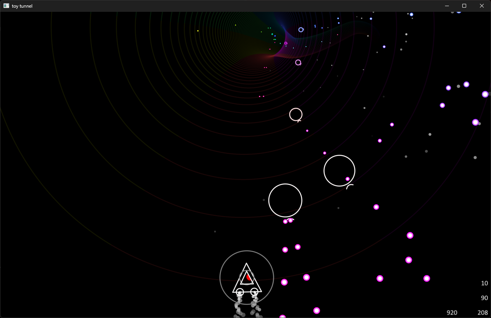
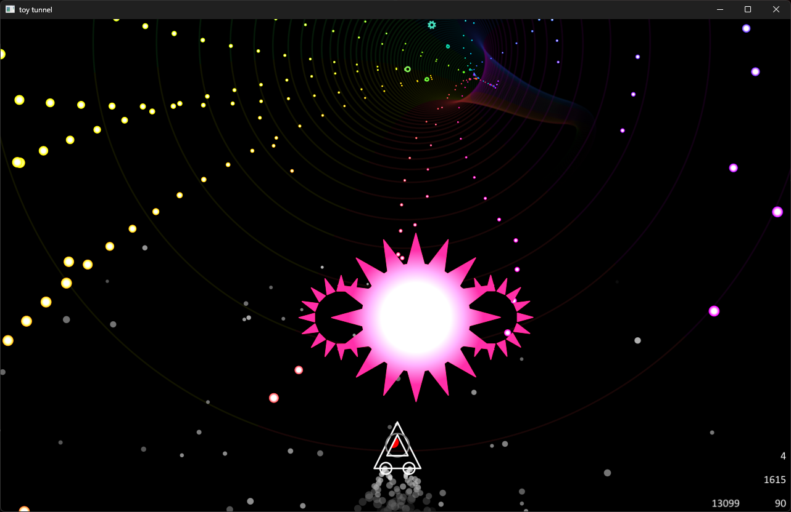

# Toy Tunnel

Small shoot'em up game going through a tunnel.  

Has 3 modes Easy, Normal, Hard.  

# Screenshots
<video src="https://github.com/user-attachments/assets/a0cc1ba5-25c8-4cc8-89c0-95b541608482" width="352" height="720"></video>
</img>
</img>

# Build
Windows run `build.bat`.  
Mac and Linux you'll need to run the following
```
mkdir build
cd build
cmake ..
cmake --build . --target toy_tunnel
```
Emscripten use `web.cmd`

# Note
When updating `tunnel_color.shd` for emscripten cmake should pickup changes, if not then you'll need to run `cute-shaderc` manually with the following
```
cute-shaderc -I./data/shaders -type=draw -varname=s_tunnel_color_shd_bytecode -oheader=./src/game/tunnel_color_shd.h ./data/shaders/tunnel_color.shd
```
For non-emscripten builds this shouldn't matter as the project is using runtime compilation.
